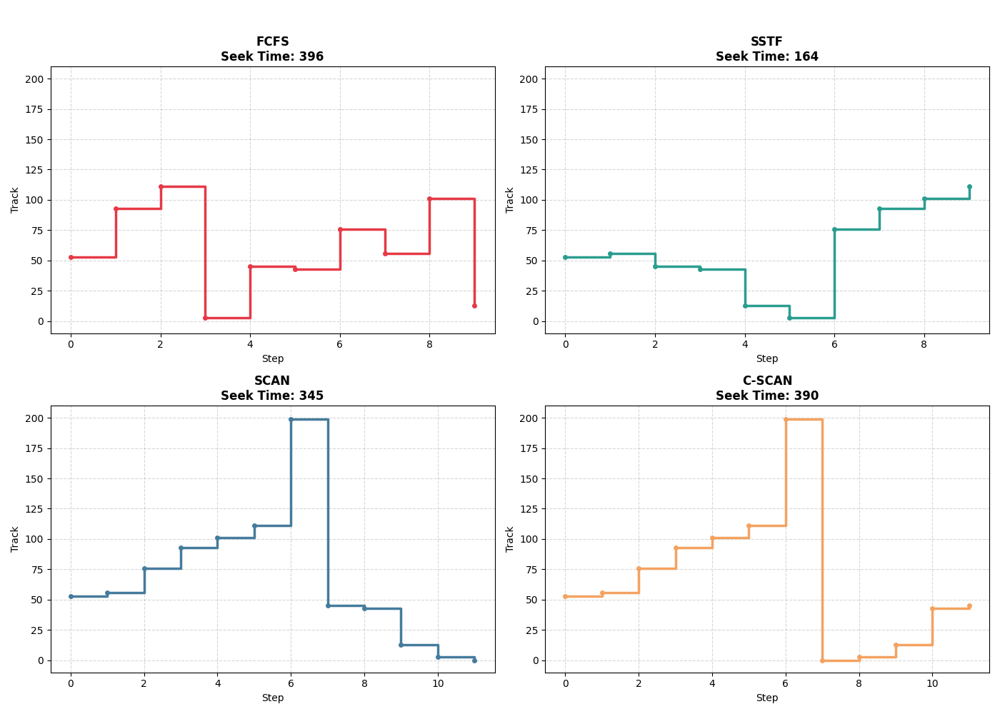
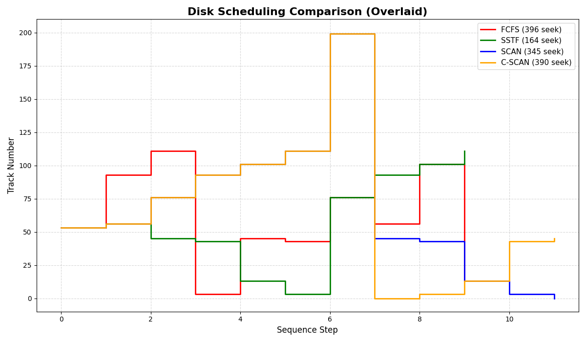

OS Disk Scheduling Algorithm Visualizer:

A Python-based simulation tool that visualizes and compares classical Operating System disk scheduling algorithms. This project demonstrates how an OS manages mechanical hard disk I/O request queues to minimize seek time and maximize efficiency.

OS Concepts Demonstrated:

Seek Time Optimization: Minimizing the physical distance the disk arm travels.
Algorithmic Trade-offs: Comparing simple queuing (FCFS) against greedy approaches (SSTF) and fair sweeping algorithms (SCAN/C-SCAN).
Resource Management: Simulating how the OS handles hardware bottlenecks.

Key Features:

Interactive CLI: Clean, colorized terminal interface built with the rich library.

Dynamic Input: Users can input custom initial head positions and request queues on the fly.

Dual Visualization Modes:

1. Generates individual step-plots for specific algorithms.
2. Generates a 2x2 Grid View for side-by-side comparison.
3. Generates an Overlay View to easily trace path intersections and total seek distances.

Tech Stack & Architecture:

The project follows clean software design principles with a strict separation of concerns:
1. Python 3 (Core Logic)
2. Matplotlib & NumPy (Data visualization and mathematical sorting)
3. Rich (Terminal UI)
4. algorithms.py: Pure mathematical logic (no UI/graphing code).
5. visualizer.py: Strictly handles Matplotlib rendering.
6. main.py: The controller handling user input and connecting the modules.

How to Run:

1. Clone the repository:
git clone "https://github.com/Zuana15/Disk-Scheduling-Algorithm.gitcd Disk-Scheduling-Algorithm"

2. Install the required dependencies:
pip install matplotlib numpy rich

3. Run the application:
python main.py

4. Follow the interactive menu to enter your disk parameters and choose which algorithms to visualize!

Sample Output:

Grid Comparison View

Overlay Comparison View

For a detailed breakdown of the algorithmic challenges faced during development (specifically handling disk boundary conditions in SCAN/C-SCAN), please view the report here: [View Technical Report](TechnicalReport.pdf)

